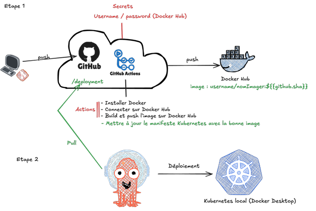

# CI/CD Pipeline avec GitHub Actions, Docker, Kubernetes et Argo CD

**Automatisation du déploiement d'une application Flask conteneurisée via GitHub Actions : construction et publication des images Docker puis déploiement sur Kubernetes avec Argo CD** 

## Architecture


## Pipeline GitOps intégrant DevOps

### Étape 1

* Application Flask simple dans [app/app.py](app/app.py)
* Dockerfile qui permet de déployer l'application Flask dans [app/Dockerfile](app/Dockerfile)
* Workflow GitHub Actions dans [.github/workflows/docker-build-push.yml](.github/workflows/docker-build-push.yml)
  * Créer les secrets GitHub (`DOCKERHUB_TOKEN` et `DOCKERHUB_USERNAME`) : `Settings -> Secrets and variables -> Actions -> New repository secret` (générez votre token dans Docker Hub au préalable)
  * Modifier la variable d'environnement `IMAGE_NAME` dans le workflow avec le nom de votre image (par défaut "ci-cd-actions-dockerhub-argo")
* Vérifier que la pipeline s'exécute sans erreur
* Vérifier que l'image a bien été envoyée dans le repository Docker Hub

### Étape 2

* Créer les fichiers Kubernetes ([k8s/deployment.yml](k8s/deployment.yml) et [k8s/service.yml](k8s/service.yml))
* Installer et lancer Argo CD

    ```bash
    # Installer le Load Balancer
    kubectl apply -f https://raw.githubusercontent.com/kubernetes/ingress-nginx/controller-v1.12.0-beta.0/deploy/static/provider/cloud/deploy.yaml

    # Install Argo CD
    kubectl create namespace argocd 
    kubectl apply -n argocd -f https://raw.githubusercontent.com/argoproj/argo-cd/stable/manifests/install.yaml

    # Mapper les ports pour accéder à Argo CD
    kubectl port-forward svc/argocd-server -n argocd 8080:443
    ```

* Se connecter à Argo CD

    ```bash
    # Récupérer le mot de passe initial
    kubectl -n argocd get secret argocd-initial-admin-secret -o jsonpath='{.data.password}'

    # Décoder la base 64 reçue via un site en ligne comme par exemple : base64decode.org
    # Se connecter à Argo CD avec admin:<base64-décodée>
    ```

* Déployer l'application dans Argo CD

    ```bash
    Project Name: default
    Repository URL: https://github.com/GstAmk/gitops-devops-pipeline.git # remplacer par l'URL de votre repo GitHub
    Path: k8s
    Cluster Name: https://kubernetes.default.svc
    Namespace: default
    ```

### Résultat attendu sur Argo CD


* Vérifier que l'application Flask fonctionne correctement et utilise bien les 3 pods : 
  * Accéder à [http://localhost:30007](http://localhost:30007) dans un navigateur web
  * Rafraîchir la page plusieurs fois pour constater que le nom du pod change à chaque requête, confirmant le load balancing entre les pods
* Dans Argo CD, la SYNC POLICY peut être configurée sur :
  * Manual → synchronisation manuelle
  * Automatic → synchronisation automatique à chaque modification dans le repo GitHub
